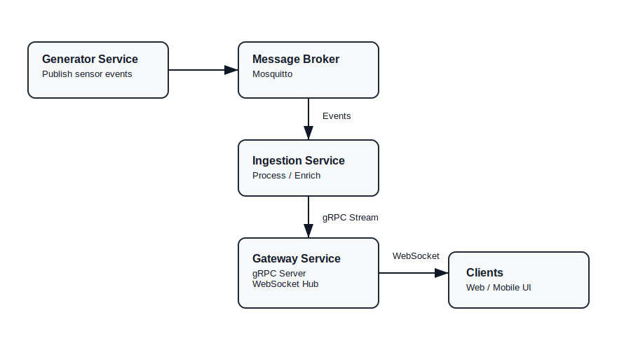

# stream-aggregator

This project implements a real-time event aggregation system for streaming simulated sensor data using Go, NATS, gRPC, and WebSockets.

## Architecture

It contains four services managed using docker.

- Generator Service: Generates and publishes simulated sensor events to MQTT topics.
- Mosquitto (MQTT): Message broker that decouples the generator service and the ingestion service and distributes sensor events between services.
- Ingestion Service: Consumes events from the message broker, and forwards them to our gateway via gRPC streaming.
- Gateway Service: Exposes a gRPC streaming endpoint for internal services and a WebSocket endpoint for external clients.



## Dependencies

- Ensure you have docker installed and running.
- Protobuf Compiler - code generation

```
go install google.golang.org/protobuf/cmd/protoc-gen-go@latest
go install google.golang.org/grpc/cmd/protoc-gen-go-grpc@latest
```

Note: You can regenerate the protobuf code using `buf generate`

## Running the App

- Clone Repo: `git clone https://github.com/manaraph/stream-aggregator.git`
- Navigate to folder: `cd stream-aggregator`
- Install dependencies: `go mod tidy`
- Copy configuration to .env using `make config` and update with your desired configuration.
- Build and run services with docker: `make up`

## Available commands

Run all commands from the project root.

### Copy environment config to .env

```
make config
```

Copy environment config from .env.example to .env
Update configuration as required

### Build and run services with docker

```
make up
```

### Shut down services in docker

```
make down
```

### Run tests with race detection

```
make test
```
