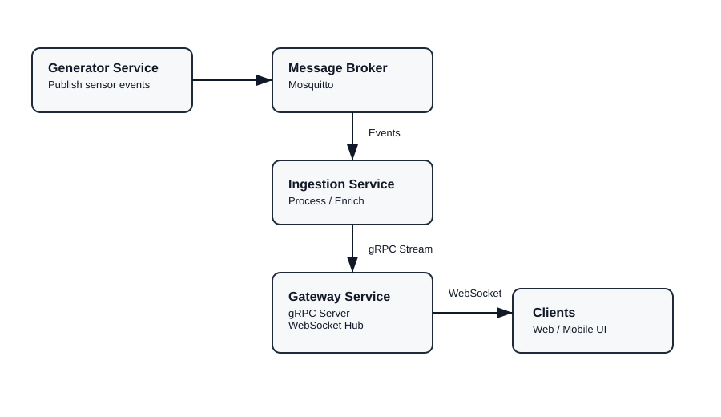

# stream-aggregator

This project implements a real-time event aggregation system for streaming simulated sensor data using Go, MQTT, gRPC, and WebSockets.

## Architecture

It contains five services managed using Docker Compose.

- Generator Service: Generates and publishes simulated sensor events to MQTT topics.
- Mosquitto (MQTT): Message broker that decouples the generator service and the ingestion service and distributes sensor events between services.
- PostgreSQL: Stores raw sensor readings on a named Docker volume so they survive container recreation.
- Ingestion Service: Consumes events from the message broker, writes readings to PostgreSQL in batches, then forwards committed readings to the gateway via gRPC streaming.
- Gateway Service: Exposes a gRPC streaming endpoint for internal services and a WebSocket endpoint for external clients.

The ingestion service flushes a batch when it reaches `DB_BATCH_SIZE` or when `DB_BATCH_INTERVAL` elapses. Defaults are 1,000 readings and 3 seconds. The bounded queue applies backpressure when PostgreSQL cannot keep up. MQTT uses QoS 1 and acknowledges valid readings only after the PostgreSQL transaction commits; duplicate deliveries are ignored by the event ID primary key. The broker also uses a persistent subscriber session and stores its own state under the mounted `mosquitto/data` directory.

Readings include the event ID, sensor ID, measurement type, unit, value, event timestamp, and database receive timestamp. The initial schema is applied automatically when ingestion starts. Time-window aggregates are intentionally computed from the raw readings when needed.

Example hourly average query:

```sql
SELECT sensor_id, measurement_type, unit,
       date_bin('1 hour', event_time, TIMESTAMPTZ '2000-01-01 00:00:00+00') AS window_start,
       AVG(value) AS average_value,
       COUNT(*) AS reading_count
FROM sensor_readings
GROUP BY sensor_id, measurement_type, unit, window_start
ORDER BY window_start, sensor_id;
```



## Dependencies

- Ensure you have docker installed and running.
- Protobuf Compiler - code generation

```
go install google.golang.org/protobuf/cmd/protoc-gen-go@latest
go install google.golang.org/grpc/cmd/protoc-gen-go-grpc@latest
```

Note: You can regenerate the protobuf code using `buf generate`. You can also lint the proto definitions with `buf lint`.

## Running the App

- Clone Repo: `git clone https://github.com/manaraph/stream-aggregator.git`
- Navigate to folder: `cd stream-aggregator`
- Install dependencies: `go mod tidy`
- Copy configuration to .env using `make config` and update with your desired configuration.
- Build and run services with docker: `make up`

## Available commands

Run all commands from the project root.

### Copy environment config to .env

```
make config
```

Copy environment config from .env.example to .env
Update configuration as required

### Build and run services with docker

```
make up
```

### Shut down services in docker

```
make down
```

### Run tests with race detection

```
make test
```

### Generate interface mocks

Mockery generates the configured interface mocks from `.mockery.yaml`:

```sh
make generate-mocks
```

Regenerate mocks after changing a configured interface. Lightweight fakes remain in tests where they model behavior such as an in-memory broker or a store that retries and records batches.

### Run PostgreSQL integration tests

```sh
make integration-test
```

This runs the storage integration test only when `TEST_DATABASE_URL` is set in the environment or `.env`; otherwise Make reports that it skipped the test. For a local Compose database, start PostgreSQL with `docker compose up -d postgres` and set `TEST_DATABASE_URL` to its host URL (usually `localhost:5432`). The test removes its uniquely prefixed rows when it finishes.

### Run tests and show coverage

```
make coverage
```

### Run tests and open coverage in the browser

```
make open-coverage
```

## TODO
- [x] Architecture and documentation.
- [x] Unit testing and CI checks for coverage and buf lint/breaking changes.
- [x] Expose websocket api for viewing metrics - event count, delivery rate, latency, etc.
- [x] Save raw sensor data to persistent PostgreSQL storage with configurable batch writes.
